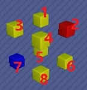

# 基于高斯消元法解决小游戏《最强大脑之一触即发》
2021最强大脑的冠军赛题目【一触即发】，连脑王都要重置多次才能做出的题目：https://tw.iqiyi.com/v_xozc57vz6c.html

本程序解决的问题是小游戏“最强大脑之一触即发”，可以在微信小游戏搜索“最强大脑之一触即发”找到它。

## 如何看某题答案？
* 1\~60题答案在answers目录1\~60.csv，嘉宾题在10001\~10002.csv，选手体验题在10003\~10005.csv
* 行列层的定义：请参考下图

**请想象在上空俯视灯阵，以灯1作为左上角，灯4作为右下角，由上到下数行，由左到右数列，由近到远数层。**

例如：第1层第1行第1列就是立方块1，第2层第2行第1列就是立方块7。更大的灯阵也遵循这一数行列层的规则。

## 怎样解出来的？
* 本题本质上是复杂化的关灯问题：https://wiki.jsswsq.com/index.php?title=%E5%85%B3%E7%81%AF%E6%B8%B8%E6%88%8F&variant=zh

    复杂化在于：2d变成3d；从只有开关2个状态变成4个状态（红黄蓝绿）

* 关灯问题可以用高斯消元法解：https://www.cnblogs.com/TheRoadToTheGold/p/8183683.html#_label1

    4个状态（红黄蓝绿）分别用模4余0、1、2、3代表
    
    特别之处在于，过程中要避免主元=2，否则程序需要递归枚举。这是因为主元=2，余数=0或2时，要特殊处理。
    
    特殊处理的原因：观察方程组
    
    x + y ≡ 1 (mod 4)
    
    x - y ≡ 1 (mod 4)
    
    显而易见，x=3，y=2，但如果用消元法（方程2-1），方程组变成：
    
    x + y ≡ 1 (mod 4)
    
    2y ≡ 2 (mod 4)
    
    y就可以是1或2，意味着消元法会增加解的数量。
    
    本程序的解决方法是：
    
    1. 尽量避免系数矩阵某行主元=2
    
    2. 假设系数矩阵是m*m，如果系数矩阵第n行主元=2，深度优先搜索所有可能的解，并用n~m行的余数验证（因为增加的解不会符合n行及之后的余数）。

## 所需软件
* Anaconda，Windows和Linux皆可

## 使用方法
1. 请先安装Anaconda，把其中的python3可执行文件设为系统默认的python可执行文件

2. 以解题1为例：

灯阵是2\*2\*2

    1. 运行：python gen_question_templates.py 2 2 2
    会生成question-templates/2-2-2.csv。它的行1是1,1,1,0,1,0,0,0
    意味着点击灯1，灯2、3、5会受影响（按“红黄蓝绿红……”的次序变动1次，游戏右下角有提示）。其他行如此类推

    2. 把question-templates/2-2-2.csv拷到questions/1.csv
    比较题面和目标图形，把差异填到1.csv的最后一列，

    例如灯1，题面是黄色（模4余1），目标是红色（模4余0），黄色变红色要动3次（0-1=-1，再模4就=3），那就把3填到1.csv的行1的最后一列。
    因为每层的目标颜色都不同，所以批量生成数据请使用“生成数据及验算的.xlsx”的“生成数据”工作表

    3. 打开gen_answers.py，question_start_idx的赋值语句修改为：
    question_start_idx = 1
    意味着要生成的是题1的答案

    4. 运行：python gen_answer.py
    会生成answers/1.txt，你就可以按照其中的步骤完成解谜。
    
**小窍门：只需要把答案中第1层的步骤做完做对，就可以不看其他层的步骤了，因为做某一层的目标就已经简化为：统一上一层的灯的颜色了，当然不能碰到上面几层的灯。**
    
    比如说题14的答案，有关层1的只有步1、2，那么做完步1、2后就可以不看答案了，步骤简化为：
        1. 点击层2的灯，把层1颜色统一
        2. 点击层3的灯，把层2颜色统一
    
    5. 【非必做】验算
    可使用“生成数据及验算的.xlsx”对应的工作表验算
    例如题1用工作表“1”验算，这里需要把层行列化为是全局的第几个灯。
    公式：因为是2*2*2，所以灯序号n = 2 * 2 * (层z - 1) + 2 * (行x - 1) + 列y
    所以层1行2列1是灯3 = 2 * 2 * (1 - 1) + (2 - 1) * 2 + 1
    整个答案就是0 0 3 0 0 0 0 0。把答案填到行9，列J会显示是否符合所有行，如果全部符合会是全部True
